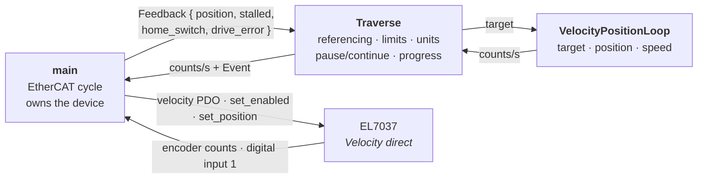
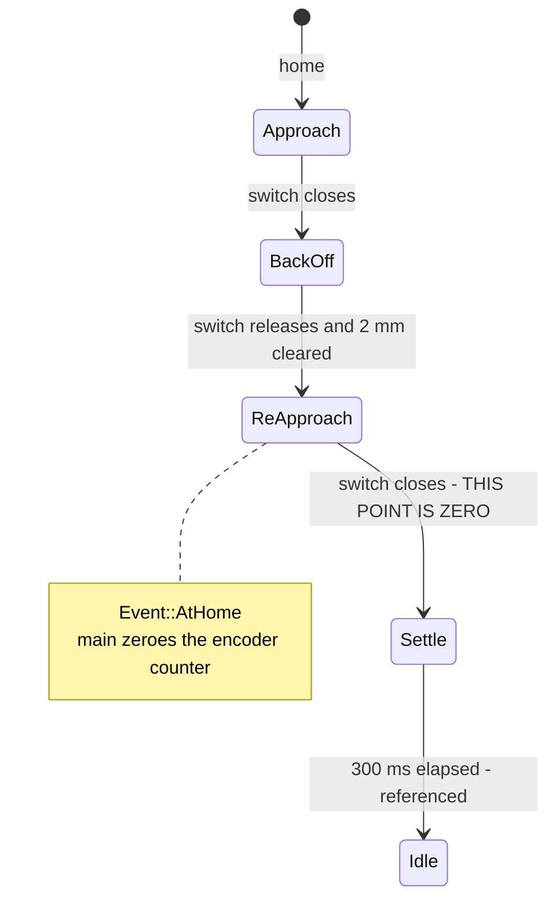

# EL7037 — Linear Traverse

Documentation for [`el7037_linear_traverse.rs`](el7037_linear_traverse.rs): a
single linear axis that references itself against a home switch, is taught a
start and an end point, and then moves to any position between them **in
millimetres**, with a progress percentage, pause/continue, and a hand-pushable
carriage.

The terminal runs in `Velocity direct` — it only ever applies the speed it is
given — and the position loop is closed in this program by
[`VelocityPositionLoop`](../ethercat_hal/src/helpers/velocity_position_loop.rs).

| | |
|---|---|
| Operation mode | `Velocity direct` |
| Cycle time | 250 µs |
| Feedback | Encoder, 4000 counts/rev |
| Home switch | digital input 1, `NormalInput` |
| Mechanics | 8 mm/rev → 500 counts/mm |
| Cruise speed | 25 mm/s, `v` changes it live |
| Top speed | 80 mm/s (2000 full steps/s ceiling) |
| Arrival band | 5 counts = 0.01 mm |

```
cargo run --example el7037_linear_traverse -- <interface>
```

---

## 1. Layering

`Traverse` and `VelocityPositionLoop` are both **pure state** — neither holds a
device handle. `main` owns the EtherCAT cycle, feeds `Traverse` its feedback,
writes back the speed it asks for, and is the only thing that touches the
terminal.



`Traverse` steers the motor **directly**, bypassing the position loop, during
homing — until the switch is found there is no target to drive to. Every other
state goes through the loop.

That split is also why `Event::AtHome` exists: the moment the switch trips,
`Traverse` has to ask `main` to zero the encoder counter for it.

---

## 2. How the loop is closed

### Control law

Every cycle the profile is recomputed from the live error `e = target - position`
and the distance to the near edge of the tolerance band, `x = |e| - tolerance`:

```text
demand = sign(e) * min( max_speed, sqrt(2 * braking_acceleration * x), approach_gain * x )
                        └ capped ┘ └─── stop-distance envelope ───┘   └─ close-in ─┘

         clamped below by min_speed, then slewed by at most acceleration * dt
```

---

## 3. What has to be set

### 3.1 Your mechanics

| Constant | Value | Meaning |
|---|---|---|
| `MM_PER_REV` | 8.0 | **Set this for your machine.** Lead-screw pitch, or belt pitch × pulley teeth. Every millimetre the program prints or accepts depends on it. |
| `COUNTS_PER_REV` | 4000 | 1000 ppr encoder, 4-fold evaluated |
| `COUNTS_PER_MM` | 500 | derived — the only place counts and millimetres meet |
| `DEFAULT_TRAVEL_MM` | 100 | end point assumed after homing, until you teach a real one |

### 3.2 Mode, feedback and the home switch

| Object | Field | Value | Why |
|---|---|---|---|
| `0x8012:01` | `operation_mode` | `DirectVelocity` | Speed-only. No travel generator, no internal position loop, nothing to fight. |
| `0x8012:05` | `speed_range` | `Steps2000` | 100 % = 2000 full steps/s = 80 mm/s on this mechanics. Also sets the resolution of every speed command. |
| `0x8012:08` | `feedback_type` | `Encoder` | Otherwise the terminal reports an internal step count and the loop closes on a fiction |
| `0x8000:0E` | `reversion_of_rotation` | `true` | Measured on the reference rig. Flip it if your switch is at the *positive* end. |
| `0x8012:32` | `function_for_input_1` | `NormalInput` | **Not the default.** The default `PlcCam` makes the terminal's *own* travel generator react to the switch; `NormalInput` just reports the level in the process image and lets this program decide. |
| `0x8012:30` | `invert_digital_input_1` | `false` | Set `true` for a normally-closed switch, so a broken wire reads as "triggered" rather than "clear" |
| — | `pdo_assignment` | `VelocityControlCompact` | Carries `StmStatus`, which is where `digital_input_1` lives |

### 3.3 Motor plate — `0x8010`

igus MOT-AN-S-060-005-042-L-C-AAAO (drylin E, NEMA 17). Replace with your own
motor's datasheet figures; wrong values show up as heat and lost steps, not as an
error.

| Sub | Field | Set to | Meaning |
|---|---|---|---|
| `:01` | `max_current` | 1100 | 1.10 A |
| `:02` | `reduced_current` | 550 | 0.55 A at standstill |
| `:03` | `nominal_voltage` | 24000 | 24 V — stored in mV, written in 10 mV units |
| `:04` | `motor_coil_resistance` | 175 | 1.75 Ω (unit: 0.01 Ω) |
| `:06` | `motor_full_steps` | 200 | 1.8° stepper |
| `:07` | `encoder_increments` | 4000 | 1000 ppr, 4-fold |
| `:0A` | `motor_coil_inductance` | 330 | 3.3 mH (unit: 0.01 mH) |


### 3.4 Wiring and mechanical convention

* Motor and encoder on the EL7037 as usual.
* **Home switch on digital input 1.**
* The switch sits at the **negative** end of travel and defines position `0`.
  Positive positions move away from it. If your machine is the other way round,
  flip `reversion_of_rotation`.

---

## 4. Homing

**The axis refuses to move until it has homed.** It comes up `Unreferenced`, and
every command except `home` is rejected with *"not referenced - home first"* —
the encoder counter is arbitrary at power-on, so a position in millimetres means
nothing until the switch has defined zero.



| Phase | Direction | Speed | Ends when |
|---|---|---|---|
| `Approach` | **negative** — towards the switch | −10 mm/s | The switch closes. If it is *already* closed this falls straight through to the back-off, which is exactly right. |
| `BackOff` | **positive** — away from the switch | +1 mm/s | The switch has released **and** at least 2 mm has been travelled from where the back-off started — so the final approach always begins outside the switch's hysteresis. |
| `ReApproach` | **negative** — towards the switch | −1 mm/s | The switch closes. **Where it trips is zero.** |
| `Settle` | still | — | 300 ms (`HOME_SETTLE`) have passed and the speed is truly zero. |

### Which way is "towards the switch"

The routine always drives **negative** to find the switch, because the switch is
assumed to sit at the negative end of travel and everything reachable lies at
positive positions from it. The program has no way to check this — it is a
mechanical convention you have to honour:

* **Switch at the negative end** (the assumption): homing works as written.
* **Switch at the positive end**: flip `config.encoder.reversion_of_rotation`.
  That reverses which way the encoder counts *and* which way a positive speed
  turns the motor, so "negative" becomes the other physical direction and homing
  runs the right way again.

Get this wrong and the first `home` drives away from the switch until
`HOMING_TIMEOUT` expires — or into the far end stop, whichever comes first. Have a
hand on the power for the first run on new mechanics.

The same convention is what makes the switch usable as a hard limit afterwards:
the fault only triggers while the commanded speed is negative, i.e. while the
carriage is heading *at* the switch.

Two approaches rather than one: the first is fast so homing does not take forever
from the far end of the axis, the second is slow so that the trip point — which
*becomes* zero — does not depend on how fast the carriage was moving when it got
there. The repeatability of the whole machine is set by `HOMING_SLOW_MM_S`.

### The switch is also a hard limit

---

## 5. Commands

All aliases are listed; anything else is rejected with *"unknown command"*.
An empty line is ignored.

| Input | Aliases | Effect |
|---|---|---|
| `home` | `h` | Reference the axis against the home switch and call that point 0 |
| `start` | | Teach the current position as the start point |
| `end` | | Teach the current position as the end point |
| `start <len>` | | Set the start point to an absolute position from home |
| `end <len>` | | Set the end point to an absolute position from home |
| `go <len>` | | Move to an absolute position, **clamped to start..end** |
| `f <0..1>` | | Move between the points: `0` = start, `1` = end, `0.5` = midpoint. The fraction is clamped, so this can never leave the taught span. |
| `v <mm/s>` | | Cruise speed. Must be positive. |
| `p` | `pause` | Pause the running move — ramps to a stop, keeps the target and the percentage |
| `c` | `continue`, `resume` | Continue the paused move |
| `s` | `stop` | Abandon the move. Unlike arriving, this leaves the loop disengaged: it will not correct the position afterwards. |
| `d` | `disable`, `free` | Cut the current so the carriage can be pushed by hand |
| `e` | `enable` | Energise the motor again, wherever the carriage now is |
| `reset` | | Clear a fault |
| `status` | | Print the status line once |
| `?` | `help` | Command list |
| `q` | `quit` | Quit — ramps down, disables, returns the bus to PreOp |

`<len>` is **millimetres unless you say otherwise**: `42`, `42mm`, `4.2cm`,
`0.042m`. Suffixes are matched longest-first, so `mm` is never read as `m`.

Note that `start` and `end` are two commands each: bare, they *teach* the position
the carriage is standing on; with an argument, they *set* an absolute one.

---

## 6. Status

`status` prints once; the same line is redrawn in place every 50 cycles (~12 ms).

```text
moving  42.3%   pos   37.20 mm | target   84.00 mm | v   25.0 mm/s | home off | start 0.00 end 100.00 mm
```

| Status | Meaning |
|---|---|
| `unreferenced` | Never homed. Only `home` is accepted. |
| `homing` | The routine is running |
| `idle` | Referenced and standing still. If the last move *arrived*, the loop is holding this position and will correct it if the carriage is pushed off. |
| `moving  NN.N%` | Running a move |
| `paused  NN.N%` | Suspended, target remembered |
| `error: <reason>` | Faulted — clear with `reset`, or re-home |
| `disabled` / `disabled, unref` | Driver stage off; the suffix says whether the position still means anything |

The percentage is measured against the distance actually commanded, and pausing
leaves the move's origin alone — so `c` carries on from the same percentage
rather than restarting at zero.

### Pushing the carriage by hand

The EL7037's encoder input is a **separate block from the motor driver**, so
cutting the current does not stop the position from being tracked. `disable`
therefore leaves the axis *referenced*: push the carriage where you want a point
and `start`/`end` will record it. That is the easy way to teach the endpoints.

While disabled the axis commands nothing and judges nothing — a de-energised
drive being shoved around would otherwise look like a runaway. `enable`
retargets the loop to wherever the carriage now is, so nothing snaps back to the
move that was interrupted.

---

## 7. Tuning constants

### Traverse

| Constant | Value | Notes |
|---|---|---|
| `CYCLE_TIME` | 250 µs | Everything "per second" is integrated at this rate |
| `DEFAULT_CRUISE_MM_S` | 25 mm/s | = 12 500 counts/s. Changeable with `v`. |
| `HOMING_FAST_MM_S` | 10 mm/s | First run at the switch |
| `HOMING_SLOW_MM_S` | 1 mm/s | Back-off and final approach — **this sets the repeatability of zero** |
| `HOMING_BACKOFF_MM` | 2 mm | Minimum clearance before the final approach |
| `HOMING_ACCEL_MM_S2` | 80 mm/s² | Slew limit for the hand-driven homing moves |
| `HOMING_TIMEOUT` | 60 s | |
| `HOME_SETTLE` | 300 ms | Waiting for the zeroed counter to echo back |
| `DRIVE_ERROR_GRACE` | 250 ms | Ignore momentary terminal errors |
| `STATUS_EVERY` | 50 cycles | ~12 ms redraw (for the terminal UI) |

### Position loop

| Field | Value | In millimetres | Notes |
|---|---|---|---|
| `max_speed` | 12 500 cnt/s | 25 mm/s | The one override — `DEFAULT_CRUISE_MM_S` |
| `acceleration` | 40 000 cnt/s² | 80 mm/s² | The real slew limit. Lower it if stall pulses appear. |
| `braking_acceleration` | 20 000 cnt/s² | 40 mm/s² | Half the real limit, as envelope margin against motor lag |
| `approach_gain` | 25 | 1/s | Close-in gain |
| `min_speed` | 100 cnt/s | 0.2 mm/s | The anti-crawl floor |
| `tolerance` | 5 counts | 0.01 mm | Arrival band |
| `dwell` | 120 ms | | Long enough that a fly-through cannot fake arrival |
| `re_engage` | 60 counts | 0.12 mm | Far wider than `tolerance`, or the axis buzzes |
| `move_timeout` | 15 s | | Longer than any legitimate move |
| `runaway_factor` | 3.0 | × | Multiplied by the commanded distance |
| `runaway_slack` | 400 counts | 0.8 mm | Additive, so short moves still get a usable allowance |
